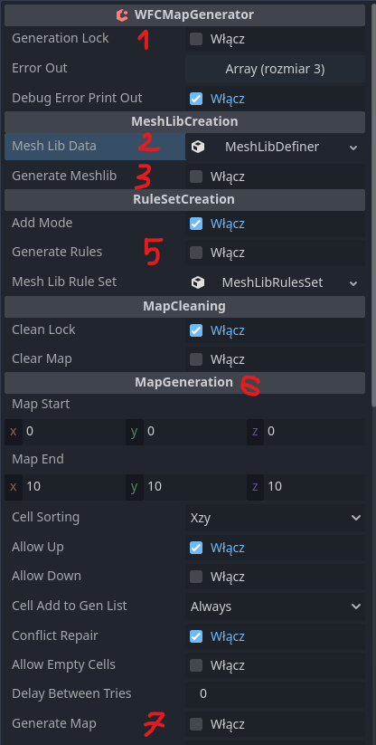

# Godot-WFC
 Hello, this is my implementation of <a href="https://github.com/mxgmn/WaveFunctionCollapse">WFC algorithm</a>.

 All is fitted in 1 node.

 # Quick Guide
 1. Disable Generation Lock.
 2. Define meshes in mesh lib data.
 3. Press Generate Mesh Lib.
 4. Paint rules, how tiles can connect. You can paint stuff like in gridmap.
 5. Press Generate Rules.
 6. Define Map Generation Settings.
 7. Press Generate Map.

exported vars Running, Time and Remaining cells shows is generator working.

# Troubleshooting
if generation wails try stopping generation by unchecking running(only if conflict repair is active)

after that check error out 
- value 0 is tile position
- value 1 are all possible tiles from each side that can be placed at that spot
- value 2 shows which arrays are being used for that cell

# Error Out
It shows last cell that had 0 possible outcomes
Array elements:
0. Position of cell.
1. List with all neighbours of cell and tiles that they allow in place of cell.
2. List of arrays from neighbour cells that were used.
